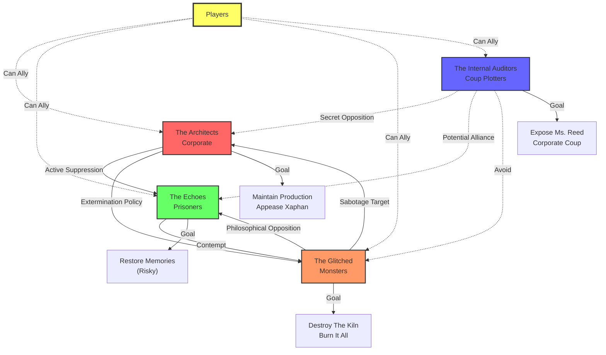

# Faction Relationships - Lulu the Piggy 2

## Mermaid Diagram

## Text Summary

### The Architects (Corporate - Red)
- **Goal:** Maintain Lulu production, appease Xaphan with 10% Essentia Tithe
- **Allies:** None (isolated by paranoia)
- **Enemies:** The Glitched (active threat), The Echoes (security risk), Internal Auditors (unknown traitors)
- **Neutral:** Players (initially—view as "Creative Partners" to be controlled)
- **Key Leverage:** Control all facility systems (Warden AI), security forces, legal authority
- **Win Condition:** Maintain status quo, prevent exposure, deliver Tithe on schedule

### The Echoes (Prisoners - Green)
- **Goal:** Restore stolen memories via Restorative Synergy (60-70% chance of Cascade Failure)
- **Allies:** Players (if convinced), potentially Internal Auditors (desperate alliance)
- **Enemies:** The Architects (active oppressors)
- **Hostile to:** The Glitched (ideological opposition - Echoes want restoration, Glitched want destruction)
- **Key Leverage:** Inside knowledge of memory systems (Leo), moral high ground, player empathy
- **Win Condition:** Access Memory Core, execute Restorative Synergy, survive Cascade Failure

### The Glitched (Monsters - Orange)
- **Goal:** Destroy The Kiln, bring down entire Chimera Wing in flames
- **Allies:** Players (if embrace chaos/vengeance)
- **Enemies:** The Architects (creators/oppressors), The Echoes (naive fools)
- **Neutral:** Internal Auditors (beneath notice)
- **Key Leverage:** Violence, chaos, intimate knowledge of facility's hidden passages (Spite), no fear of death
- **Win Condition:** Kiln destroyed, facility burns, everyone "freed" through annihilation

### The Internal Auditors (Coup Plotters - Blue)
- **Goal:** Gather evidence, expose Ms. Reed to board, corporate coup (not revolution)
- **Allies:** Players (if pragmatic), potentially Echoes (mutual enemy in Ms. Reed)
- **Enemies:** Ms. Reed specifically (not entire Architect faction)
- **Avoid:** The Glitched (too chaotic, would hurt company beyond repair)
- **Key Leverage:** Legal knowledge (Alex), technical access (Socket), corporate protocols
- **Win Condition:** Evidence uploaded to board, Ms. Reed removed, program "indefinitely suspended," NDAs for all

---

## Relationship Details

### The Architects ↔ The Echoes
**Relationship:** Hostile (Active Suppression)
**Why:** Echoes are failed products/security risks. Architects conduct "Re-calibration" (forced memory wipes) to maintain control.
**Player Opportunity:** Exploit Architects' paranoia. Make them believe Echoes are more organized/dangerous than they are, diverting security resources.

### The Architects ↔ The Glitched
**Relationship:** Hostile (Extermination)
**Why:** Glitched are "defective products" and active saboteurs. Architects use security Lulus to destroy Glitched on sight.
**Player Opportunity:** Engineer Glitched attack on Architect facility to create chaos during player infiltration/escape.

### The Echoes ↔ The Glitched
**Relationship:** Hostile (Philosophical)
**Why:** Echoes cling to hope of restoration; Glitched see this as delusion. Glitched would sabotage Restorative Synergy if given chance.
**Player Opportunity:** Play factions against each other. Promise Heartbreak that sabotaging Echoes will weaken Architects (true), or promise Rem protection from Glitched in exchange for cooperation.

### The Internal Auditors ↔ The Architects
**Relationship:** Secret Opposition
**Why:** Alex and Socket still work for corporation but oppose Ms. Reed's methods and infernal contract. They want "internal reform" not revolution.
**Player Opportunity:** This path avoids most violence. Corporate intrigue instead of combat. Suitable for stealth/social-focused parties.

### The Internal Auditors ↔ The Echoes
**Relationship:** Potential Uneasy Alliance
**Why:** Both oppose Ms. Reed. Auditors might help Echoes escape as part of evidence against Ms. Reed ("look at these victims!").
**Player Opportunity:** Broker alliance. Convince Alex that helping Echoes escape is "good optics" for his case to the board.

### The Internal Auditors ↔ The Glitched
**Relationship:** Avoidance
**Why:** Glitched destruction would destroy company (Auditors' goal is reform, not collapse). Auditors see Glitched as uncontrollable.
**Player Opportunity:** Limited. Could threaten to unleash Glitched if Auditors don't cooperate (risky—might make Auditors flee).

---

## Player Exploitation Strategies

### Play All Sides
**Strategy:** Make promises to multiple factions, use each against the others
**Example:** Promise Echoes you'll help with Restorative Synergy, promise Glitched you'll sabotage it, promise Auditors you'll gather evidence peacefully
**Risk:** If factions communicate, players become enemy of all. High difficulty, high reward.

### Faction Consolidation
**Strategy:** Unite two compatible factions against common enemy
**Options:**
- Echoes + Internal Auditors vs. Architects (most stable alliance)
- Glitched + Players vs. Everyone (chaos path)
**Risk:** Moderate. Requires diplomacy checks and keeping factions separated until ready.

### Divide and Conquer
**Strategy:** Sabotage faction efforts to weaken all sides, then exploit power vacuum
**Example:** Sabotage Restorative Synergy to weaken Echoes, leak Glitched plans to Architects, steal evidence before Auditors can use it
**Risk:** Requires high deception. If caught, no faction will trust players again.

### Single Faction Loyalty
**Strategy:** Fully commit to one faction's goals
**Options:**
- Architects: Maintain status quo, become corporate enforcers (dark path)
- Echoes: Risk everything for memory restoration (heroic but risky)
- Glitched: Burn it all down (cathartic chaos)
- Auditors: Corporate coup (pragmatic, least casualties)
**Risk:** Low betrayal risk, but locks players into one ending path.

---

## Faction Timeline Conflicts

### Day 1 (Players Arrive)
- **Architects:** Business as usual, assign players to workstations
- **Echoes (Rem):** Makes first contact in Design Studio
- **Glitched:** Planning "Hijack the Signal" broadcast
- **Auditors (Alex):** Breaking down on Legal Bridge

### Day 2 (If Players Don't Act)
- **Architects:** Continue production, Ms. Reed increases security due to Glitched activity
- **Echoes:** Rem captured during second contact attempt (failed stealth)
- **Glitched:** Execute "Hijack the Signal" without player help (50% success chance)
- **Auditors (Alex):** Taken for "Re-calibration," lead lost

### Day 3 (Endgame Acceleration)
- **Architects:** Tithe deadline approaches, Ms. Reed becomes desperate/aggressive
- **Echoes:** Without players, Leo attempts Restorative Synergy alone (fails, Cascade Failure kills several Echoes)
- **Glitched:** Storm The Kiln (if Signal succeeded), massive battle
- **Auditors:** Socket locks down workshop, becomes unreachable

### Day 4 (Point of No Return)
- **Architects:** Tithe delivered, Xaphan's power over facility increases
- **Echoes:** Crushed or evacuated
- **Glitched:** Destroyed or victorious (Kiln explodes)
- **Auditors:** Flee facility or become casualties

**DM Note:** Use timeline to create urgency. Players cannot explore indefinitely. Factions will act with or without them.

---

*Generated from 01_Factions.md | Last updated: October 2025*
