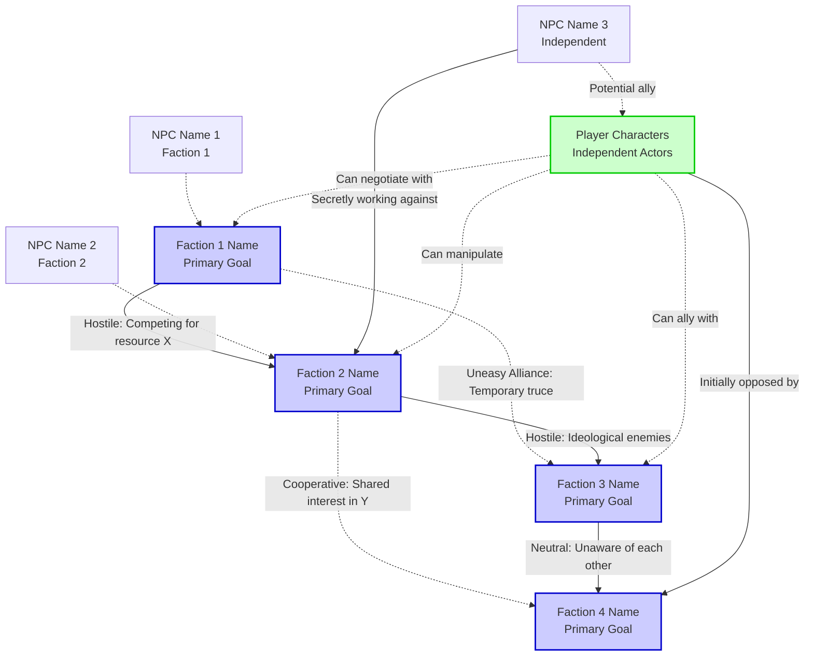

# Faction Diagram: [ADVENTURE_NAME]

**Visual relationship map for faction-based adventure design.**

## Faction Relationship Diagram

**Relationship Legend:**
- **Solid line (→)**: Hostile or antagonistic relationship
- **Dashed line (-.->)**: Cooperative, allied, or friendly relationship
- **No line**: Neutral or unaware of each other

---

## Faction Overviews

### Faction 1: [NAME]

**Primary Goal:** [What this faction wants to achieve in the adventure]

**Resources:** [What they have - soldiers, money, magic, information, etc.]

**Key NPCs:**
- **[NPC Name]** ([Role in Faction]) - [Brief description]
- **[NPC Name]** ([Role in Faction]) - [Brief description]

**Current Status:** [Where they are at the start of the adventure]

**Proactive Timeline:** [What they will do if players don't interfere]
- **Day 1:** [Action]
- **Day 3:** [Action]
- **Day 5:** [Action]
- **Day 7:** [Endgame if unchecked]

---

### Faction 2: [NAME]

**Primary Goal:** [What this faction wants to achieve]

**Resources:** [What they have]

**Key NPCs:**
- **[NPC Name]** ([Role]) - [Description]
- **[NPC Name]** ([Role]) - [Description]

**Current Status:** [Starting position]

**Proactive Timeline:**
- **Day 1:** [Action]
- **Day 3:** [Action]
- **Day 5:** [Action]
- **Day 7:** [Endgame]

---

### Faction 3: [NAME]

**Primary Goal:** [What this faction wants]

**Resources:** [What they have]

**Key NPCs:**
- **[NPC Name]** ([Role]) - [Description]

**Current Status:** [Starting position]

**Proactive Timeline:**
- **Day 1:** [Action]
- **Day 3:** [Action]
- **Day 5:** [Action]

---

### Faction 4: [NAME] (Optional)

**Primary Goal:** [What this faction wants]

**Resources:** [What they have]

**Key NPCs:**
- **[NPC Name]** ([Role]) - [Description]

**Current Status:** [Starting position]

**Proactive Timeline:**
- **Day 1:** [Action]
- **Day 3:** [Action]

---

## Relationship Details

### Faction 1 ↔ Faction 2: [Relationship Type]

**Nature of Conflict/Cooperation:**
[Detailed explanation of why these factions interact this way]

**Flashpoints:**
- [Specific location/issue where conflict might erupt]
- [Another potential conflict point]

**Player Exploitation:**
- **Option 1:** [How players could use this relationship - e.g., "Play them against each other by revealing Faction 1's plan to Faction 2"]
- **Option 2:** [Another exploitation strategy]
- **Option 3:** [Third strategy]

**Possible Outcomes:**
- **If players side with Faction 1:** [What happens to Faction 2]
- **If players side with Faction 2:** [What happens to Faction 1]
- **If players play both sides:** [Potential consequences]
- **If players ignore:** [What happens naturally]

---

### Faction 1 ↔ Faction 3: [Relationship Type]

**Nature of Conflict/Cooperation:**
[Explanation]

**Flashpoints:**
- [Conflict point]
- [Conflict point]

**Player Exploitation:**
- **Option 1:** [Strategy]
- **Option 2:** [Strategy]

**Possible Outcomes:**
- **If players side with Faction 1:** [Result]
- **If players side with Faction 3:** [Result]
- **If players broker alliance:** [Result]

---

### Faction 2 ↔ Faction 3: [Relationship Type]

**Nature of Conflict/Cooperation:**
[Explanation]

**Flashpoints:**
- [Conflict point]

**Player Exploitation:**
- **Option 1:** [Strategy]

**Possible Outcomes:**
- **If players escalate conflict:** [Result]
- **If players de-escalate:** [Result]

---

### [Continue for all faction pairings]

---

## Timeline Conflicts

**Visualization of when faction goals clash:**

| Day | Faction 1 Action | Faction 2 Action | Faction 3 Action | Conflict Point |
|-----|------------------|------------------|------------------|----------------|
| 1 | [Action] | [Action] | [Action] | [Where timelines clash, if any] |
| 3 | [Action] | [Action] | [Action] | [Conflict description] |
| 5 | [Action] | [Action] | [Action] | [Conflict description] |
| 7 | [Action] | [Action] | [Action] | [Major conflict/endgame] |

**Key Conflict Moments:**

1. **Day [X]: [Event Name]**
   - **What happens:** [Description of clash]
   - **Factions involved:** [List]
   - **Player opportunity:** [How players can intervene]

2. **Day [Y]: [Event Name]**
   - **What happens:** [Description]
   - **Factions involved:** [List]
   - **Player opportunity:** [Intervention option]

---

## Player Strategies

### Strategy 1: Ally with Faction 1

**How it works:**
[Step-by-step approach to allying with Faction 1]

**Advantages:**
- [Benefit 1]
- [Benefit 2]
- [Benefit 3]

**Disadvantages:**
- [Drawback 1]
- [Drawback 2]

**Likely outcome:**
[What happens if players pursue this fully]

---

### Strategy 2: Play All Sides

**How it works:**
[Step-by-step approach to manipulating factions]

**Advantages:**
- [Benefit 1]
- [Benefit 2]

**Disadvantages:**
- [Drawback 1 - e.g., "Risk of exposure"]
- [Drawback 2]

**Likely outcome:**
[What happens if successful vs. if caught]

---

### Strategy 3: Destroy All Factions

**How it works:**
[Step-by-step approach to eliminating all factions]

**Advantages:**
- [Benefit 1]

**Disadvantages:**
- [Drawback 1]
- [Drawback 2]

**Likely outcome:**
[What happens - power vacuum, etc.]

---

### Strategy 4: Broker Peace

**How it works:**
[Step-by-step approach to resolving conflicts]

**Advantages:**
- [Benefit 1]
- [Benefit 2]

**Disadvantages:**
- [Drawback 1]

**Likely outcome:**
[What happens if peace holds vs. falls apart]

---

## Independent Actors

**NPCs not aligned with any faction:**

### [NPC Name 1]

**Current Status:** [Where they are, what they're doing]

**Goals:** [What they want]

**Potential Alliances:**
- **With Players:** [Conditions under which they'd ally]
- **With Faction X:** [Conditions]

**Leverage:** [What they offer/what they can be threatened with]

---

### [NPC Name 2]

**Current Status:** [Description]

**Goals:** [What they want]

**Potential Alliances:**
- **With Players:** [Conditions]
- **With Faction Y:** [Conditions]

**Leverage:** [Offers/threats]

---

## Session Tracking

**Use this section to track faction status changes during actual play:**

### Session [N] - [Date]

**Faction Status Changes:**
- **Faction 1:** [What changed - e.g., "Lost 2 soldiers, now aware of PC involvement"]
- **Faction 2:** [What changed]
- **Faction 3:** [What changed]

**Relationship Changes:**
- **Faction 1 ↔ Faction 2:** [e.g., "Uneasy alliance → Open hostility due to PC deception"]
- **Faction 2 ↔ Players:** [e.g., "Neutral → Hostile after combat encounter"]

**Timeline Adjustments:**
- **Faction 1:** [e.g., "Accelerated Day 5 action to Day 3 due to PC interference"]
- **Faction 3:** [e.g., "Delayed Day 3 action - leader wounded"]

**Notes:**
[Freeform notes about faction developments]

---

### Session [N+1] - [Date]

[Same structure as above]

---

## DM Notes

**Key principles for running faction-based adventures:**

1. **Factions act independently:** Even when players aren't looking, factions pursue their goals. Update faction status between sessions based on proactive timelines.

2. **NPCs have agency:** NPCs within factions don't blindly follow orders. They have personal motivations that players can exploit.

3. **Information is power:** The more players learn about faction goals and conflicts, the better they can manipulate situations. Don't reveal everything immediately.

4. **Consequences matter:** Player choices should visibly affect faction power balance. If they sabotage Faction 1, Faction 2 should gain ground.

5. **No "correct" path:** There are multiple valid strategies. Don't railroad players toward one faction or approach.

**Improvisation tips:**
- If players ally with unexpected faction, use NPC betrayal conditions to create drama
- If players ignore all factions, advance timelines aggressively to force engagement
- If one faction is eliminated early, consider having surviving factions splinter into sub-factions

**Balance considerations:**
- Track faction resources (soldiers, money, magic items) numerically
- If one faction becomes too powerful, introduce internal conflict or third-party interference
- Ensure each faction has at least one exploitable weakness players can discover
